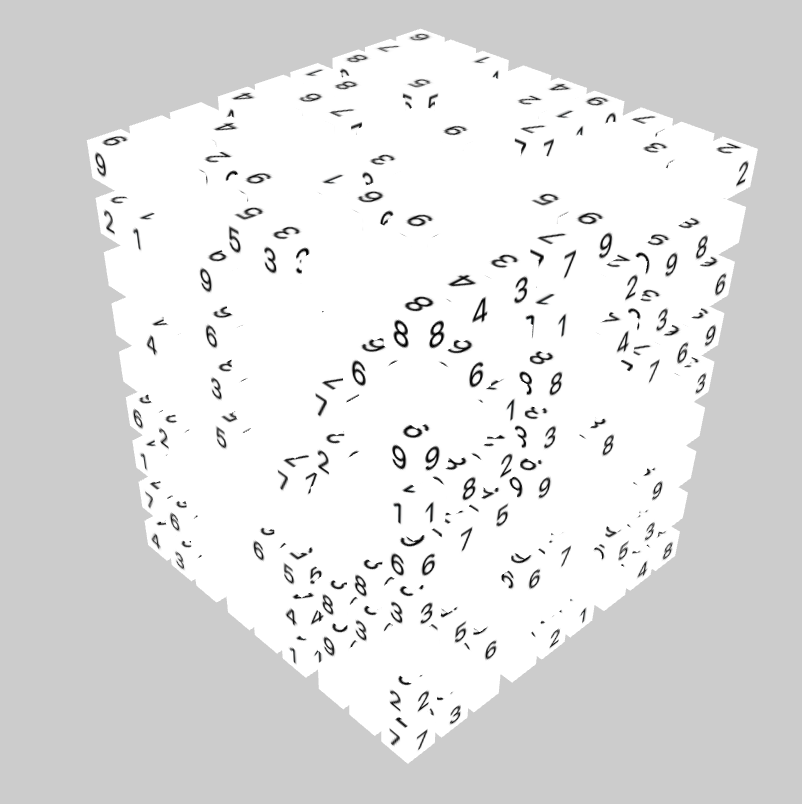

Viewable at stevensawtelle.surge.sh/sudokube

What happens if you take 6 sudoku puzzles and stitch them together on the faces of a cube? You get a sudokube! This is a fun new puzzle type I invented (as far as I'm aware, would be happy to know if this has been done before) where each face of a cube is a standalone sudoku puzzle that can be solved, but also shares the edges with its' neighboring faces' sudoku puzzles.

Still heavily WIP as a project!